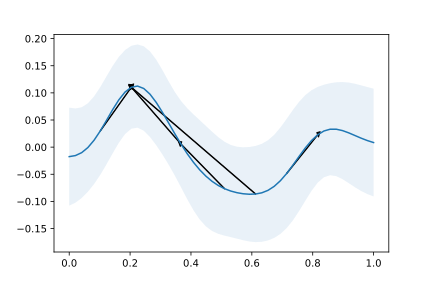

# Example of A Tutorial on Bayesian Optimization

A repo include example of paper, A Tutorial on Bayesian Optimization of
Expensive Cost Functions, with Application to
Active User Modeling and Hierarchical
Reinforcement Learning.

Given facts:

* 0.2 ≻ 0.1
* 0.35 ≻ 0.5
* 0.2 ≻ 0.35
* 0.2 ≻ 0.6
* 0.8 ≻ 0.7

and pose a gaussian process prior, how can we infer about the hidden function?

See [`demonstration.ipynb`](demonstration.ipynb) for detail.

While the original paper use Laplace approximation, this implementation use HMC with Stan/PyStan to do inference.

## References

* [Brochu, Eric, Vlad M. Cora, and Nando De Freitas. "A tutorial on Bayesian optimization of expensive cost functions, with application to active user modeling and hierarchical reinforcement learning." arXiv preprint arXiv:1012.2599 (2010).](https://arxiv.org/pdf/1012.2599.pdf?bcsi_scan_dd0fad490e5fad80=fwQqmV5CfHDAMm8dFLewPK+h1WGiAAAAkj1aUQ%3D%3D&bcsi_scan_filename=1012.2599.pdf&utm_content=buffered388&utm_medium=social&utm_source=plus.google.com&utm_campaign=buffer)
